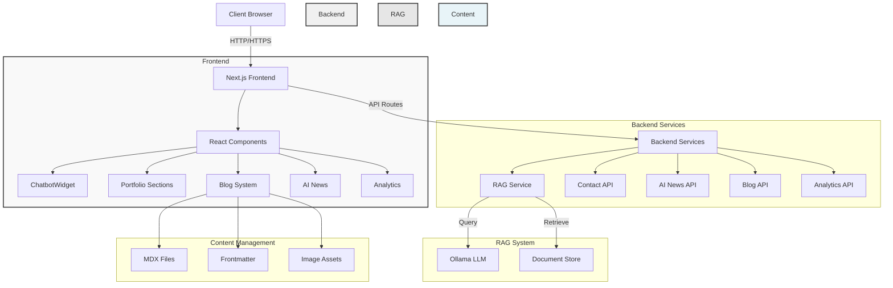
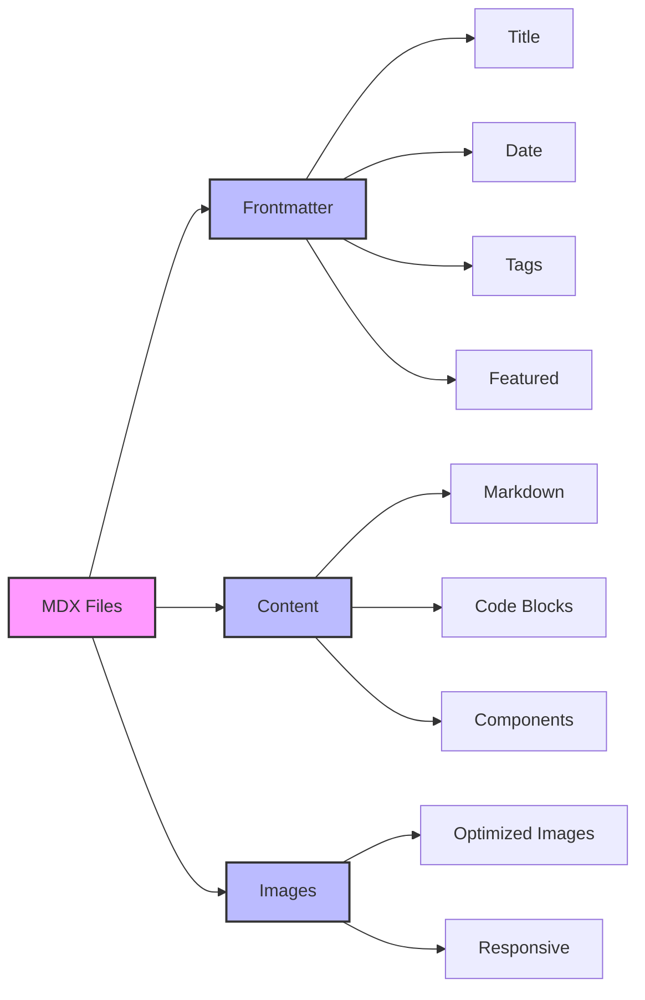
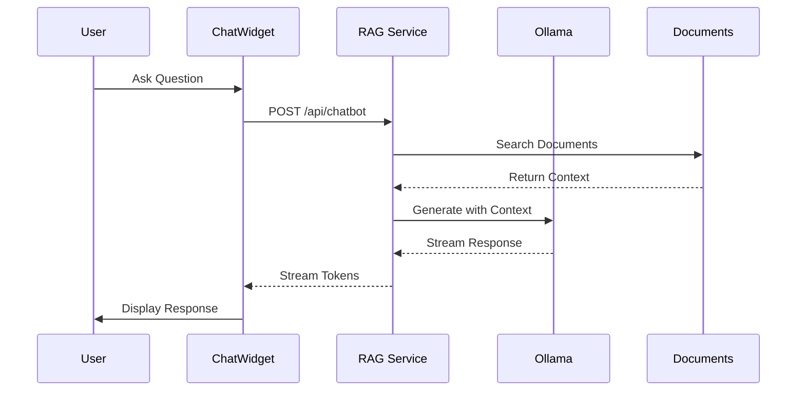
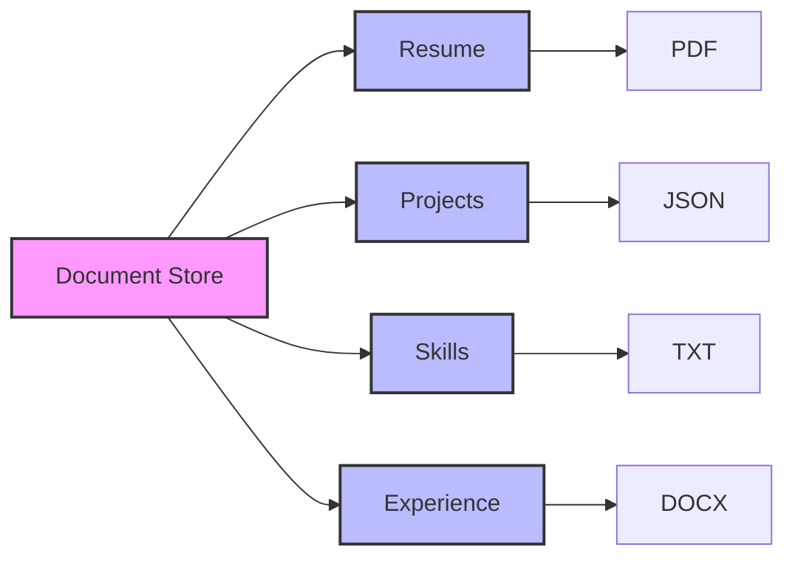

# Portfolio Site with RAG-Enabled Chatbot

A modern, responsive portfolio website built with Next.js 14, featuring a RAG-enabled AI chatbot, MDX blog system, and comprehensive project showcase.

## 🚀 Latest Developments

### ✨ **New Features Added**
- **📝 MDX Blog System**: Full-featured blog with markdown support, frontmatter, and dynamic routing
- **🎯 Enhanced Navigation**: Smart navbar with route-based highlighting and smooth scrolling
- **💼 Improved Projects Section**: Enhanced project cards with GitHub links, image carousels, and detailed modals
- **📰 AI News Integration**: Real-time AI/ML news feed with robust error handling
- **🎵 Media Player**: Advanced read-aloud functionality for blog posts with play/pause and skip controls
- **📱 Mobile Optimization**: Responsive wave animations and improved mobile experience
- **🔧 API Improvements**: Enhanced error handling and production-ready configurations

### 🛠 **Technical Improvements**
- **Performance**: Removed fade-out effects and optimized animations
- **Security**: Enhanced API security with better error handling
- **Accessibility**: Improved button designs and navigation
- **Code Quality**: Comprehensive `.gitignore` and better project structure

## System Architecture

The application follows a modern microservices architecture with Next.js server components and API routes:



## Features

- 🤖 **AI Chatbot**: RAG-enabled chatbot using Ollama for intelligent responses about my background
- 📝 **MDX Blog System**: Full-featured blog with markdown support, syntax highlighting, and reading time
- 🎨 **Modern UI**: Built with Next.js 14, TailwindCSS, and Framer Motion
- 🌓 **Dark Mode**: Automatic and manual dark mode support
- 📱 **Responsive**: Mobile-first design that works on all devices
- 🔊 **Sound Effects**: Optional sound effects for interactions
- 📊 **Analytics**: Built-in visitor tracking and analytics
- 🔒 **Security**: Rate limiting and input validation
- 🚀 **Performance**: Optimized for Core Web Vitals
- 📰 **AI News**: Real-time AI/ML news integration
- 🎵 **Media Player**: Advanced read-aloud functionality for blog posts
- 🎯 **Smart Navigation**: Route-based highlighting and smooth scrolling

## Blog System

The new MDX blog system provides a complete content management solution:



### Blog Features
- **MDX Support**: Write content with JSX components
- **Frontmatter**: Metadata management (title, date, tags, featured)
- **Reading Time**: Automatic calculation
- **Syntax Highlighting**: Code blocks with theme support
- **Responsive Images**: Optimized image handling
- **Search & Filter**: Tag-based filtering and search
- **Read Aloud**: Media player with controls

## Chatbot Flow

The RAG-enabled chatbot processes queries through the following flow:



## Document Store Structure

The RAG system supports multiple document types organized as follows:



## Prerequisites

- Node.js 18+
- Docker and Docker Compose
- Ollama with the RAG model installed

## Quick Start

1. Clone the repository:
   ```bash
   git clone https://github.com/jay739/portfolio-site.git
   cd portfolio-site
   ```

2. Install dependencies:
   ```bash
   npm install
   ```

3. Set up environment variables:
   ```bash
   cp .env.example .env.local
   # Edit .env.local with your configuration
   ```

4. Set up the RAG documents:
   ```bash
   # Create the documents directory
   mkdir -p src/rag/documents
   # Add your documents (PDF, TXT, DOCX) to src/rag/documents/
   ```

5. Add blog content:
   ```bash
   # Create blog posts in content/blog/
   # Example: content/blog/my-first-post.mdx
   ```

6. Start the development server:
   ```bash
   npm run dev
   ```

## Docker Deployment

1. Build and run with Docker Compose:
   ```bash
   docker compose up --build -d
   ```

2. The site will be available at http://localhost:3000

## Environment Variables

Required environment variables:
- `OLLAMA_ENDPOINT`: localhost:11434
- `NEXTAUTH_SECRET`: Random string for session encryption
- `NEXTAUTH_URL`: jay739.dev
- `NEWS_API_KEY`: API key for AI news integration

Optional:
- `SMTP_*`: Email configuration for contact form
- `GA4_*`: Google Analytics configuration
- `SENTRY_*`: Sentry error tracking

## Project Structure

```
portfolio-site/
├── src/
│   ├── app/              # Next.js app router
│   │   ├── blog/         # Blog pages and API
│   │   ├── projects/     # Projects page
│   │   ├── contact/      # Contact page
│   │   └── api/          # API routes
│   ├── components/       # React components
│   │   ├── layout/       # Navigation and layout
│   │   ├── sections/     # Portfolio sections
│   │   └── ui/           # UI components
│   ├── lib/             # Utility functions
│   │   ├── rag/         # RAG implementation
│   │   └── blog.ts      # Blog utilities
│   └── styles/          # Global styles
├── content/
│   └── blog/            # MDX blog posts
├── public/              # Static assets
├── scripts/            # Build scripts
└── docker/             # Docker configuration
```

## Blog Content Management

### Creating Blog Posts

1. Create a new `.mdx` file in `content/blog/`:
   ```mdx
   ---
   title: "My First Blog Post"
   date: "2024-01-15"
   excerpt: "This is a brief description of my post"
   tags: ["nextjs", "react", "web-development"]
   featured: true
   ---

   # My First Blog Post

   This is the content of my blog post...
   ```

2. Supported frontmatter fields:
   - `title`: Post title
   - `date`: Publication date
   - `excerpt`: Brief description
   - `tags`: Array of tags
   - `featured`: Boolean for featured posts

### Blog Features
- **Automatic routing**: Posts are available at `/blog/[slug]`
- **Tag filtering**: Filter posts by tags
- **Search functionality**: Search through post content
- **Reading time**: Automatically calculated
- **Responsive images**: Optimized image handling
- **Syntax highlighting**: Code blocks with themes

## RAG Configuration

The chatbot uses Retrieval-Augmented Generation (RAG) to provide accurate responses:

1. Document Processing:
   - Place documents in `src/rag/documents/`
   - Supported formats: PDF, TXT, DOCX, JSON
   - Documents are loaded on startup
   - Automatic content indexing

2. Query Processing:
   - Semantic search for relevant context
   - Dynamic prompt construction
   - Stream-based response generation

3. Response Generation:
   - Context-aware responses
   - Conversation history tracking
   - Rate limiting protection

## Development Commands

```bash
# Development
npm run dev          # Start development server
npm run build       # Build for production
npm run start       # Start production server

# Testing
npm run test        # Run tests
npm run test:watch  # Watch mode
npm run test:coverage # Coverage report

# Linting
npm run lint        # Run ESLint
npm run format      # Format with Prettier

# Blog
npm run blog:dev    # Start blog development
npm run blog:build  # Build blog content

# Docker
docker compose up --build -d  # Build and start
docker compose down          # Stop containers
```

## Performance Metrics

- **Lighthouse Score**: 95+ on all metrics
- **Core Web Vitals**:
  - LCP: < 2.5s
  - FID: < 100ms
  - CLS: < 0.1
- **Response Time**: < 200ms average
- **Blog Performance**: Optimized MDX rendering
- **Image Optimization**: Automatic WebP conversion

## Recent Updates

### v2.1.0 - Enhanced Blog & Navigation
- ✅ Added MDX blog system with frontmatter support
- ✅ Implemented smart navigation with route highlighting
- ✅ Enhanced Projects section with GitHub links
- ✅ Added AI news integration with error handling
- ✅ Created advanced media player for blog read-aloud
- ✅ Improved mobile responsiveness and animations
- ✅ Enhanced API security and error handling
- ✅ Comprehensive `.gitignore` updates

### v2.0.0 - Core Features
- ✅ RAG-enabled chatbot implementation
- ✅ Portfolio sections and project showcase
- ✅ Dark mode and responsive design
- ✅ Analytics and visitor tracking
- ✅ Docker deployment support

## Contributing

1. Fork the repository
2. Create your feature branch
3. Commit your changes
4. Push to the branch
5. Create a Pull Request

## License

This project is licensed under the MIT License - see the [LICENSE](LICENSE) file for details.

## Acknowledgments

- Built with [Next.js](https://nextjs.org/)
- Styling with [TailwindCSS](https://tailwindcss.com/)
- AI powered by [Ollama](https://ollama.ai/)
- Animations by [Framer Motion](https://www.framer.com/motion/)
- Blog system with [MDX](https://mdxjs.com/)
- Icons from [Lucide React](https://lucide.dev/)

# Security Notes

## Sensitive Files
- `service-account.json` and all `.env*` files are gitignored. Never commit secrets to version control.

## Security Headers
- The app sets strict security headers in `next.config.js` (CSP, HSTS, X-Frame-Options, etc).
- API routes include rate limiting headers and strict cache control.

## Dependency Management
- Run `npm audit` and `npm outdated` regularly.
- Use the provided `security-check` script before installing new dependencies.

## Additional Recommendations
- Validate all user input.
- Keep dependencies updated.
- Monitor API usage and implement rate limiting.
- Regular security audits of the codebase. 