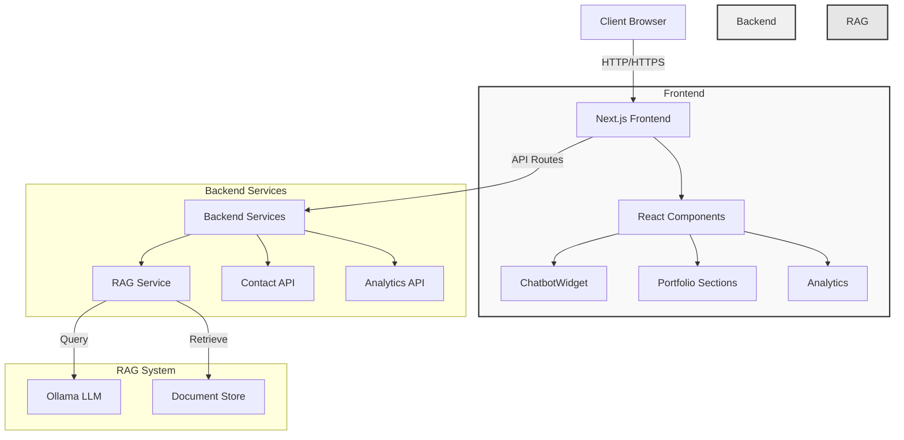
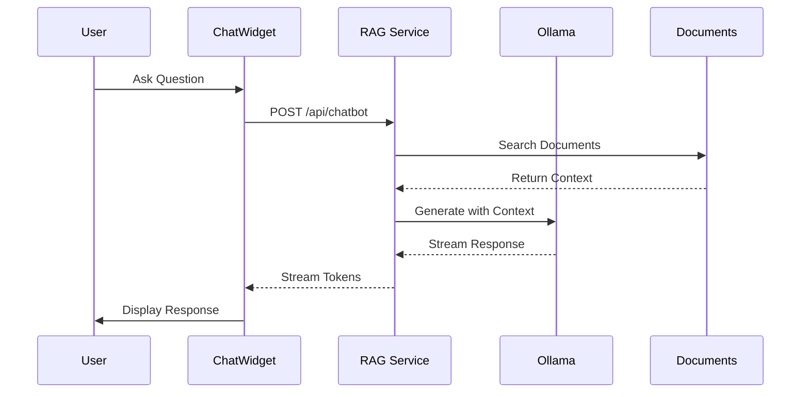
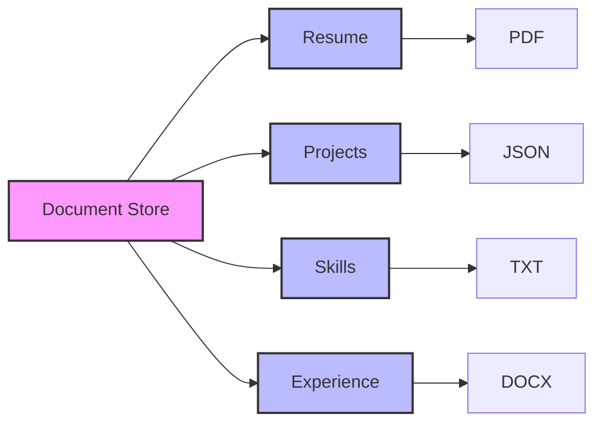

# Portfolio Site with RAG-Enabled Chatbot

A modern, responsive portfolio website built with Next.js 14, featuring a RAG-enabled AI chatbot that can answer questions about my background, experience, and projects.

## System Architecture

The application follows a modern microservices architecture with Next.js server components and API routes:



## Features

- 🤖 **AI Chatbot**: RAG-enabled chatbot using Ollama for intelligent responses about my background
- 🎨 **Modern UI**: Built with Next.js 14, TailwindCSS, and Framer Motion
- 🌓 **Dark Mode**: Automatic and manual dark mode support
- 📱 **Responsive**: Mobile-first design that works on all devices
- 🔊 **Sound Effects**: Optional sound effects for interactions
- 📊 **Analytics**: Built-in visitor tracking and analytics
- 🔒 **Security**: Rate limiting and input validation
- 🚀 **Performance**: Optimized for Core Web Vitals

## Chatbot Flow

The RAG-enabled chatbot processes queries through the following flow:



## Document Store Structure

The RAG system supports multiple document types organized as follows:



## Prerequisites

- Node.js 18+
- Docker and Docker Compose
- Ollama with the RAG model installed

## Quick Start

1. Clone the repository:
   ```bash
   git clone https://github.com/jay739/portfolio-site.git
   cd portfolio-site
   ```

2. Install dependencies:
   ```bash
   npm install
   ```

3. Set up environment variables:
   ```bash
   cp .env.example .env.local
   # Edit .env.local with your configuration
   ```

4. Set up the RAG documents:
   ```bash
   # Create the documents directory
   mkdir -p src/rag/documents
   # Add your documents (PDF, TXT, DOCX) to src/rag/documents/
   ```

5. Start the development server:
   ```bash
   npm run dev
   ```

## Docker Deployment

1. Build and run with Docker Compose:
   ```bash
   docker compose up --build -d
   ```

2. The site will be available at http://localhost:3000

## Environment Variables

Required environment variables:
- `OLLAMA_ENDPOINT`: localhost:11434
- `NEXTAUTH_SECRET`: Random string for session encryption
- `NEXTAUTH_URL`: jay739.dev

Optional:
- `SMTP_*`: Email configuration for contact form
- `GA4_*`: Google Analytics configuration
- `SENTRY_*`: Sentry error tracking

## Project Structure

```
portfolio-site/
├── src/
│   ├── app/              # Next.js app router
│   ├── components/       # React components
│   ├── lib/             # Utility functions
│   │   └── rag/         # RAG implementation
│   └── styles/          # Global styles
├── public/              # Static assets
├── scripts/            # Build scripts
└── docker/             # Docker configuration
```

## RAG Configuration

The chatbot uses Retrieval-Augmented Generation (RAG) to provide accurate responses:

1. Document Processing:
   - Place documents in `src/rag/documents/`
   - Supported formats: PDF, TXT, DOCX, JSON
   - Documents are loaded on startup
   - Automatic content indexing

2. Query Processing:
   - Semantic search for relevant context
   - Dynamic prompt construction
   - Stream-based response generation

3. Response Generation:
   - Context-aware responses
   - Conversation history tracking
   - Rate limiting protection

## Development Commands

```bash
# Development
npm run dev          # Start development server
npm run build       # Build for production
npm run start       # Start production server

# Testing
npm run test        # Run tests
npm run test:watch  # Watch mode
npm run test:coverage # Coverage report

# Linting
npm run lint        # Run ESLint
npm run format      # Format with Prettier

# Docker
docker compose up --build -d  # Build and start
docker compose down          # Stop containers
```

## Performance Metrics

- **Lighthouse Score**: 95+ on all metrics
- **Core Web Vitals**:
  - LCP: < 2.5s
  - FID: < 100ms
  - CLS: < 0.1
- **Response Time**: < 200ms average

## Contributing

1. Fork the repository
2. Create your feature branch
3. Commit your changes
4. Push to the branch
5. Create a Pull Request

## License

This project is licensed under the MIT License - see the [LICENSE](LICENSE) file for details.

## Acknowledgments

- Built with [Next.js](https://nextjs.org/)
- Styling with [TailwindCSS](https://tailwindcss.com/)
- AI powered by [Ollama](https://ollama.ai/)
- Animations by [Framer Motion](https://www.framer.com/motion/)

# Security Notes

## Sensitive Files
- `service-account.json` and all `.env*` files are gitignored. Never commit secrets to version control.

## Security Headers
- The app sets strict security headers in `next.config.js` (CSP, HSTS, X-Frame-Options, etc).
- API routes include rate limiting headers and strict cache control.

## Dependency Management
- Run `npm audit` and `npm outdated` regularly.
- Use the provided `security-check` script before installing new dependencies.

## Additional Recommendations
- Validate all user input.
- Use parameterized queries for any database access.
- Implement CSRF protection for forms and API routes.
- Handle errors gracefully to avoid leaking sensitive information.
- Use secure password hashing if handling authentication.

## Reporting Vulnerabilities
- Add a `security.txt` file or contact info for responsible disclosure. 