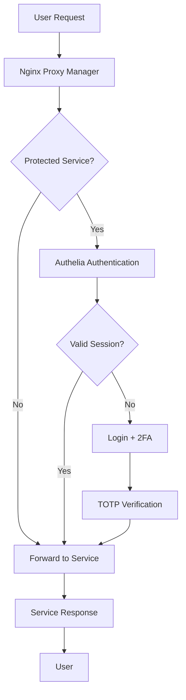

## 🛡️ The Security Foundation

Welcome to **Part 2** of my Home Server Chronicles! In Part 1, we explored the overall architecture and philosophy behind my Docker-powered ecosystem. Now, let's dive into the **core services** that form the backbone of secure external access.

These three services work together to create a robust, secure gateway to my home lab:

- 🌐 **Nginx Proxy Manager** — Reverse proxy with SSL termination
- 🔐 **Authelia** — 2FA authentication gateway  
- 🔒 **WireGuard (wg-easy)** — VPN tunnel for remote access

---

## 🌐 Nginx Proxy Manager: The Traffic Director

### Why NPM Over Traefik?

I chose **Nginx Proxy Manager** over Traefik for several reasons:

- 🎯 **Web UI**: Clean, intuitive interface for managing proxy hosts
- 🔐 **Built-in SSL**: Automatic Let's Encrypt certificate generation
- 📊 **Real-time logs**: Easy debugging with live access logs
- 🎨 **Theme integration**: Works seamlessly with theme.park for dark mode
- 🔧 **Flexibility**: Easy custom configurations and advanced routing

### Configuration

Here's how NPM is configured in my `core.yml`:

```yaml
nginx-proxy-manager:
  image: jc21/nginx-proxy-manager:latest
  container_name: nginx-proxy-manager
  restart: unless-stopped
  ports:
    - "80:80"                  # ✅ PUBLIC - HTTP proxy hosts
    - "443:443"                # ✅ PUBLIC - HTTPS proxy hosts
    - "127.0.0.1:81:81"        # ✅ LOCALHOST - admin interface
    - "10.0.0.110:81:81"       # ✅ LOCAL NETWORK - admin interface
    - "100.89.188.84:81:81"    # ✅ TAILSCALE - admin interface
  environment:
    - DISABLE_IPV6=true
    - TP_THEME=dark
    - TP_URL=http://theme-park:80
  volumes:
    - ./nginx-proxy-manager/data:/data
    - ./nginx-proxy-manager/letsencrypt:/etc/letsencrypt
  networks:
    - proxy_net
```

### Key Features in Action

**🔗 Proxy Hosts**: Each service gets its own subdomain:
- `jellyfin.jay739.dev` → `jellyfin:8096`
- `tools.jay739.dev` → `it-tools:80`
- `notes.jay739.dev` → `paperless-ngx:8000`

**🔐 SSL Certificates**: Automatically managed via Let's Encrypt:
- Wildcard certificates for `*.jay739.dev`
- Auto-renewal every 60 days
- HTTP to HTTPS redirect enforced

**🎨 Dark Theme**: Integration with theme.park for consistent dark mode across all services.

---

## 🔐 Authelia: The Authentication Guardian

### Two-Factor Authentication Everywhere

**Authelia** acts as a forward-auth middleware, protecting sensitive services with TOTP-based 2FA. It integrates seamlessly with Nginx Proxy Manager to add an authentication layer.

### Architecture

```
User Request → NPM → Authelia (if protected) → Target Service
```

### Configuration

In `infra.yml`, Authelia is configured with:

```yaml
authelia:
  image: authelia/authelia:latest
  container_name: authelia
  restart: unless-stopped
  volumes:
    - ./authelia/config:/config
    - ./authelia/secrets:/secrets
  environment:
    - TZ=America/New_York  
  depends_on:
    - redis
  networks:
    - proxy_net
  ports:
    - "10.0.0.110:9091:9091"     # ✅ LOCAL NETWORK ACCESS
    - "100.89.188.84:9091:9091"  # ✅ TAILSCALE ACCESS
```

### What Gets Protected?

I use a tiered approach to security:

**🔒 High Security (2FA Required)**:
- Portainer (container management)
- Nginx Proxy Manager admin
- Vaultwarden (password manager)
- VS Code Server

**🔓 Medium Security (Local Network Only)**:
- Jellyfin (media streaming)
- Paperless-ngx (documents)
- Homarr (dashboard)

**🌐 Public Access**:
- Portfolio website
- IT-Tools (utility tools)
- Read-only services

### Setup Process

1. **Initial Configuration**: Users and groups defined in `users_database.yml`
2. **TOTP Setup**: Each user scans QR code with Google Authenticator
3. **Policy Rules**: Access control based on domains and user groups
4. **Session Management**: Remember devices for 30 days

---

## 🔒 WireGuard VPN: The Secure Tunnel

### Why WireGuard?

WireGuard provides the **secure tunnel** for remote access to my home lab. I use **wg-easy** for simplified management:

- 🚀 **Performance**: Modern, lightweight VPN protocol
- 🔧 **Easy Management**: Web UI for client configuration
- 📱 **Mobile Support**: Works great on iOS/Android
- 🔐 **Security**: State-of-the-art cryptography

### Configuration

```yaml
wg-easy:
  image: weejewel/wg-easy
  container_name: wg-easy
  restart: unless-stopped
  network_mode: host
  environment:
    - WG_HOST=${WG_HOST}
    - PASSWORD=${WG_PASSWORD}
    - WG_PORT=51820
    - WG_ALLOWED_IPS=0.0.0.0/0
    - WG_DEFAULT_DNS=172.25.0.7  # Points to Pi-hole
  volumes:
    - ./wg-easy:/etc/wireguard
  cap_add:
    - NET_ADMIN
    - SYS_MODULE
```

### Network Layout

My VPN setup creates a secure overlay network:

```
Internet → WireGuard (51820) → Home Network (10.0.0.0/24)
                                      ↓
                                Docker Networks
                                      ↓
                                 Services
```

### Client Configuration

Each device gets its own WireGuard configuration:

- **Work Laptop**: Full tunnel for secure remote work
- **Phone**: Split tunnel for accessing home services
- **Tablet**: Media streaming and document access

---

## 🚦 Traffic Flow: How It All Works Together

Here's the complete request flow for a protected service:



### Example: Accessing Portainer

1. **Request**: User navigates to `portainer.jay739.dev`
2. **NPM**: Nginx Proxy Manager receives request
3. **Auth Check**: Forwards to Authelia for authentication
4. **2FA**: User enters username/password + TOTP code
5. **Session**: Authelia creates session cookie
6. **Forwarding**: Request forwarded to Portainer container
7. **Response**: Portainer interface loads

---

## 🎯 Access Patterns

I've designed three distinct access patterns:

### 🏠 Local Network (10.0.0.110)
- **Usage**: When I'm at home
- **Security**: Reduced authentication for convenience
- **Services**: All services accessible directly

### 🌐 Internet (jay739.dev subdomains)
- **Usage**: Public internet access
- **Security**: Full 2FA protection for sensitive services
- **Services**: Curated list of safe-to-expose services

### 🔐 VPN Tunnel (100.89.188.84)
- **Usage**: Remote work and administration
- **Security**: VPN + 2FA for maximum security
- **Services**: Full access to all services

---

## 🔧 Management & Monitoring

### Nginx Proxy Manager Admin
- **URL**: `https://npm.jay739.dev:81`
- **Features**: 
  - Live access logs
  - SSL certificate management
  - Custom location blocks
  - Fail2ban integration

### Authelia Dashboard
- **URL**: `https://auth.jay739.dev:9091`
- **Features**:
  - User session management
  - 2FA device enrollment
  - Access attempt logs
  - Policy testing

### WireGuard Management
- **URL**: `https://vpn.jay739.dev:51821`
- **Features**:
  - Client configuration QR codes
  - Bandwidth monitoring
  - Connection status
  - Easy client management

---

## 🚨 Security Considerations

### Defense in Depth
- **Layer 1**: Firewall (ufw) blocks unnecessary ports
- **Layer 2**: VPN tunnel for remote access
- **Layer 3**: Reverse proxy with rate limiting
- **Layer 4**: 2FA authentication for sensitive services
- **Layer 5**: Container isolation and least privilege

### Fail2ban Integration
```bash
# Monitors NPM logs for failed auth attempts
[nginx-proxy-manager]
enabled = true
port = http,https
filter = nginx-proxy-manager
logpath = /var/log/nginx-proxy-manager/*.log
maxretry = 3
bantime = 86400
```

### Regular Security Tasks
- Monthly SSL certificate renewal checks
- Quarterly user access reviews
- Regular backup of configuration files
- Monitor auth logs for suspicious activity

---

## 🎉 Benefits of This Stack

### For Security
- ✅ **Zero Trust**: Every request authenticated
- ✅ **Encrypted Transit**: All traffic over HTTPS/VPN
- ✅ **Audit Trail**: Complete access logging
- ✅ **Isolation**: Services can't access each other unnecessarily

### For Convenience
- ✅ **Single Sign-On**: One auth session for all services
- ✅ **Custom Domains**: Memorable subdomains for each service
- ✅ **Mobile Access**: Full functionality on phone/tablet
- ✅ **Offline Capability**: VPN works even when internet is down

### For Maintenance
- ✅ **Centralized Management**: One interface for all proxy configs
- ✅ **Automated SSL**: Set-and-forget certificate management
- ✅ **Easy Troubleshooting**: Clear logs and error messages
- ✅ **Backup/Restore**: Simple configuration file management

---

## 🚀 What's Next?

In **Part 3**, we'll explore the **Infrastructure Layer** — the tools that keep everything running smoothly:

- 🐳 **Portainer**: Container management with a web UI
- 💻 **VS Code Server**: Cloud-based development environment
- 📊 **Netdata**: Real-time system monitoring
- 🔄 **Watchtower**: Automated container updates
- 💾 **Backup Strategy**: Protecting your data

This foundation of core services makes everything else possible. With secure access, authentication, and VPN connectivity in place, we can confidently expose our services to the internet while maintaining tight security controls.

---

👈 [Part 1 ← Introduction & Architecture](./docker-series-part1)  
👉 [Part 3 → Infrastructure Layer (Coming Soon)](#)

**Questions or want to replicate this setup? Feel free to reach out!**

**— Jayakrishna**
