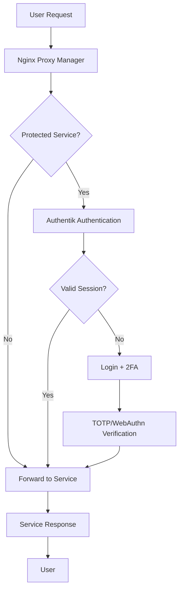

## <Shield /> The Security Foundation

Welcome to **Part 2** of my Home Server Chronicles! In Part 1, we explored the overall architecture and philosophy behind my Docker-powered ecosystem. Now, let's dive into the **core services** that form the backbone of secure external access.

These three services work together to create a robust, secure gateway to my home lab:

- <Globe /> **Nginx Proxy Manager** — Reverse proxy with SSL termination
- <Lock /> **Authentik** — SSO/2FA identity provider  
- <Key /> **Tailscale** — Mesh VPN for remote access

---

## <Globe /> Nginx Proxy Manager: The Traffic Director

### Why NPM Over Traefik?

I chose **Nginx Proxy Manager** over Traefik for several reasons:

- <Target /> **Web UI**: Clean, intuitive interface for managing proxy hosts
- <Lock /> **Built-in SSL**: Automatic Let's Encrypt certificate generation
- <BarChart /> **Real-time logs**: Easy debugging with live access logs
- <Palette /> **Theme integration**: Works seamlessly with theme.park for dark mode
- <Wrench /> **Flexibility**: Easy custom configurations and advanced routing

### Configuration

Here's how NPM is configured in my `core.yml`:

```yaml
nginx-proxy-manager:
  image: jc21/nginx-proxy-manager:latest
  container_name: nginx-proxy-manager
  restart: unless-stopped
  ports:
    - "80:80"                  # PUBLIC - HTTP proxy hosts
    - "443:443"                # PUBLIC - HTTPS proxy hosts
    - "127.0.0.1:81:81"        # LOCALHOST - admin interface
    - "${HOST_IP:-10.0.0.101}:81:81"       # LOCAL NETWORK - admin interface
    - "100.89.188.84:81:81"    # TAILSCALE - admin interface
  environment:
    - DISABLE_IPV6=true
    - TP_THEME=dark
    - TP_URL=http://theme-park:80
  volumes:
    - ./nginx-proxy-manager/data:/data
    - ./nginx-proxy-manager/letsencrypt:/etc/letsencrypt
  networks:
    - proxy_net
```

### Key Features in Action

**<ChainLink /> Proxy Hosts**: Each service gets its own subdomain:
- `jellyfin.jay739.dev` → `jellyfin:8096`
- `tools.jay739.dev` → `it-tools:80`
- `notes.jay739.dev` → `paperless-ngx:8000`

**<Lock /> SSL Certificates**: Automatically managed via Let's Encrypt:
- Wildcard certificates for `*.jay739.dev`
- Auto-renewal every 60 days
- HTTP to HTTPS redirect enforced

**<Palette /> Dark Theme**: Integration with theme.park for consistent dark mode across all services.

---

## <Lock /> Authentik: The Identity Provider

### Full SSO with Two-Factor Authentication

**Authentik** is a self-hosted identity provider that acts as the SSO layer across all my services. It replaced Authelia early on because I needed richer features — SAML/OIDC support, user management UI, and application-level access policies. It integrates with Nginx Proxy Manager via forward-auth headers.

### Architecture

```
User Request → NPM → Authentik (if protected) → Target Service
```

### Configuration

In `infra.yml`, Authentik runs as a server + worker pair backed by its own PostgreSQL and Redis instances:

```yaml
authentik-server:
  image: ghcr.io/goauthentik/server:latest
  container_name: authentik-server
  restart: unless-stopped
  command: server
  environment:
    - AUTHENTIK_SECRET_KEY=${AUTHENTIK_SECRET_KEY}
    - AUTHENTIK_POSTGRESQL__HOST=authentik-postgres
    - AUTHENTIK_POSTGRESQL__NAME=authentik
    - AUTHENTIK_POSTGRESQL__USER=authentik
    - AUTHENTIK_POSTGRESQL__PASSWORD=${AUTHENTIK_DB_PASSWORD}
    - AUTHENTIK_REDIS__HOST=authentik-redis
  ports:
    - "${HOST_IP:-10.0.0.101}:9001:9000"
    - "100.89.188.84:9001:9000"
  depends_on:
    - authentik-postgres
    - authentik-redis
  networks:
    - proxy_net

authentik-worker:
  image: ghcr.io/goauthentik/server:latest
  container_name: authentik-worker
  restart: unless-stopped
  command: worker
  # ... same env vars as server
```

### What Gets Protected?

I use a tiered approach to security:

**<Lock /> High Security (SSO + 2FA Required)**:
- Portainer (container management)
- Nginx Proxy Manager admin
- Vaultwarden (password manager)
- Immich (photo library)

**<Key /> Medium Security (Local Network / Tailscale Only)**:
- Jellyfin (media streaming)
- Paperless-NGX (documents)
- Homarr / Homepage (dashboards)
- Open WebUI (LLM interface)

**<Globe /> Public Access**:
- Portfolio website (jay739.dev)
- IT-Tools, Vert, Paste (utility tools)

### Setup Process

1. **Initial Setup**: Admin account created on first boot, users/groups managed via Authentik admin UI
2. **TOTP/WebAuthn**: Each user enrolls 2FA devices through the Authentik user dashboard
3. **Application Providers**: Each service registered as an Authentik Application with proxy provider
4. **Session Management**: Configurable session duration with remember-me support

---

## <Key /> Tailscale: The Mesh VPN

### Why Tailscale?

Tailscale provides a **WireGuard-based mesh VPN** that connects all my devices without port forwarding or complex configuration:

- <Rocket /> **Zero Config**: No port forwarding, NAT traversal handled automatically
- <Wrench /> **MagicDNS**: Automatic DNS for all devices on the tailnet
- <Laptop /> **Cross-Platform**: Works on macOS, iOS, Android, Linux, Windows
- <Lock /> **WireGuard Under the Hood**: State-of-the-art cryptography
- <Globe /> **Exit Nodes**: Route traffic through any device on the tailnet

### Setup

Tailscale runs natively on the host (not in a container) for best performance:

```bash
# Install and authenticate
curl -fsSL https://tailscale.com/install.sh | sh
sudo tailscale up --accept-routes --advertise-exit-node
```

### Network Layout

My Tailscale tailnet connects 8 devices across multiple platforms:

```
Batcave (100.89.188.84)  ←→  Oracle VPS (100.80.153.103)
       ↕                              ↕
MacBook Air (100.103.152.9)    iPhone (100.105.125.76)
Mac Mini (100.104.170.37)      Pixel 7 (100.79.158.25)
```

The Oracle VPS acts as an **exit node**, and all services bind to both the LAN IP (`10.0.0.101`) and Tailscale IP (`100.89.188.84`) for multi-path access.

### Split DNS

I use dnsmasq on Batcave with custom DNS records pointing `*.jay739.dev` to the LAN IP (`10.0.0.101`), so devices on the local network can reach services directly without depending on Tailscale. See my [Tailscale resilience post](./tailscale-resilient-homelab-networking) for how I eliminated Tailscale as a single point of failure.

---

## <Network /> Traffic Flow: How It All Works Together

Here's the complete request flow for a protected service:


```mermaid
flowchart TD
    A[User Request] --> B[Nginx Proxy Manager]
    B --> C{Protected Service?}
    C -->|Yes| D[Authentik Authentication]
    C -->|No| E[Direct to Service]
    D --> F{Valid Session?}
    F -->|No| G[Login + 2FA]
    F -->|Yes| E
    G --> H[TOTP/WebAuthn Verification]
    H --> E[Forward to Service]
    E --> I[Service Response]
    I --> J[User]
```

### Example: Accessing Portainer

1. **Request**: User navigates to `portainer.jay739.dev`
2. **NPM**: Nginx Proxy Manager receives request
3. **Auth Check**: Forward-auth header triggers Authentik
4. **2FA**: User enters username/password + TOTP code
5. **Session**: Authentik creates session cookie
6. **Forwarding**: Request forwarded to Portainer container
7. **Response**: Portainer interface loads

---

## <Target /> Access Patterns

I've designed three distinct access patterns:

### <Home /> Local Network (10.0.0.101)
- **Usage**: When I'm at home
- **Security**: Reduced authentication for convenience
- **Services**: All services accessible directly

### <Globe /> Internet (jay739.dev subdomains)
- **Usage**: Public internet access
- **Security**: Full 2FA protection for sensitive services
- **Services**: Curated list of safe-to-expose services

### <Lock /> Tailscale Mesh VPN (100.89.188.84)
- **Usage**: Remote work and administration from anywhere
- **Security**: WireGuard encryption + Authentik 2FA for maximum security
- **Services**: Full access to all services via Tailscale IP bindings

---

## <Wrench /> Management & Monitoring

### Nginx Proxy Manager Admin
- **URL**: `https://npm.jay739.dev:81`
- **Features**: 
  - Live access logs
  - SSL certificate management
  - Custom location blocks
  - Fail2ban integration

### Authentik Admin
- **URL**: `https://auth.jay739.dev`
- **Features**:
  - Full user/group management UI
  - Application provider configuration (proxy, OIDC, SAML)
  - 2FA device enrollment (TOTP, WebAuthn)
  - Flow designer for custom login experiences
  - Event logs and audit trail

### Tailscale Admin
- **URL**: [Tailscale Admin Console](https://login.tailscale.com/admin)
- **Features**:
  - Device management across the tailnet
  - ACL policy configuration
  - Exit node management
  - MagicDNS and Split DNS settings

---

## <Warning /> Security Considerations

### Defense in Depth
- **Layer 1**: Firewall (ufw) blocks unnecessary ports
- **Layer 2**: Tailscale mesh VPN for remote access
- **Layer 3**: Reverse proxy with rate limiting
- **Layer 4**: 2FA authentication for sensitive services
- **Layer 5**: Container isolation and least privilege

### Fail2ban Integration
```bash
# Monitors NPM logs for failed auth attempts
[nginx-proxy-manager]
enabled = true
port = http,https
filter = nginx-proxy-manager
logpath = /var/log/nginx-proxy-manager/*.log
maxretry = 3
bantime = 86400
```

### Regular Security Tasks
- Monthly SSL certificate renewal checks
- Quarterly user access reviews
- Regular backup of configuration files
- Monitor auth logs for suspicious activity

---

## <Star /> Benefits of This Stack

### For Security
- <Check /> **Zero Trust**: Every request authenticated
- <Check /> **Encrypted Transit**: All traffic over HTTPS/VPN
- <Check /> **Audit Trail**: Complete access logging
- <Check /> **Isolation**: Services can't access each other unnecessarily

### For Convenience
- <Check /> **Single Sign-On**: One auth session for all services
- <Check /> **Custom Domains**: Memorable subdomains for each service
- <Check /> **Mobile Access**: Full functionality on phone/tablet
- <Check /> **Offline Capability**: VPN works even when internet is down

### For Maintenance
- <Check /> **Centralized Management**: One interface for all proxy configs
- <Check /> **Automated SSL**: Set-and-forget certificate management
- <Check /> **Easy Troubleshooting**: Clear logs and error messages
- <Check /> **Backup/Restore**: Simple configuration file management

---

## <Rocket /> What's Next?

In **Part 3**, we'll explore the **Infrastructure Layer** — the tools that keep everything running smoothly:

- <Docker /> **Portainer**: Container management with a web UI
- <Laptop /> **VS Code Server**: Cloud-based development environment
- <BarChart /> **Netdata**: Real-time system monitoring
- <Repeat /> **Watchtower**: Automated container updates
- <Save /> **Backup Strategy**: Protecting your data

This foundation of core services makes everything else possible. With secure access, authentication, and VPN connectivity in place, we can confidently expose our services to the internet while maintaining tight security controls.

---

[Part 1 ← Introduction & Architecture](./docker-series-part1)  
[Part 3 → Infrastructure Layer](./docker-series-part3)

**Questions or want to replicate this setup? Feel free to reach out!**

**— Jayakrishna**
